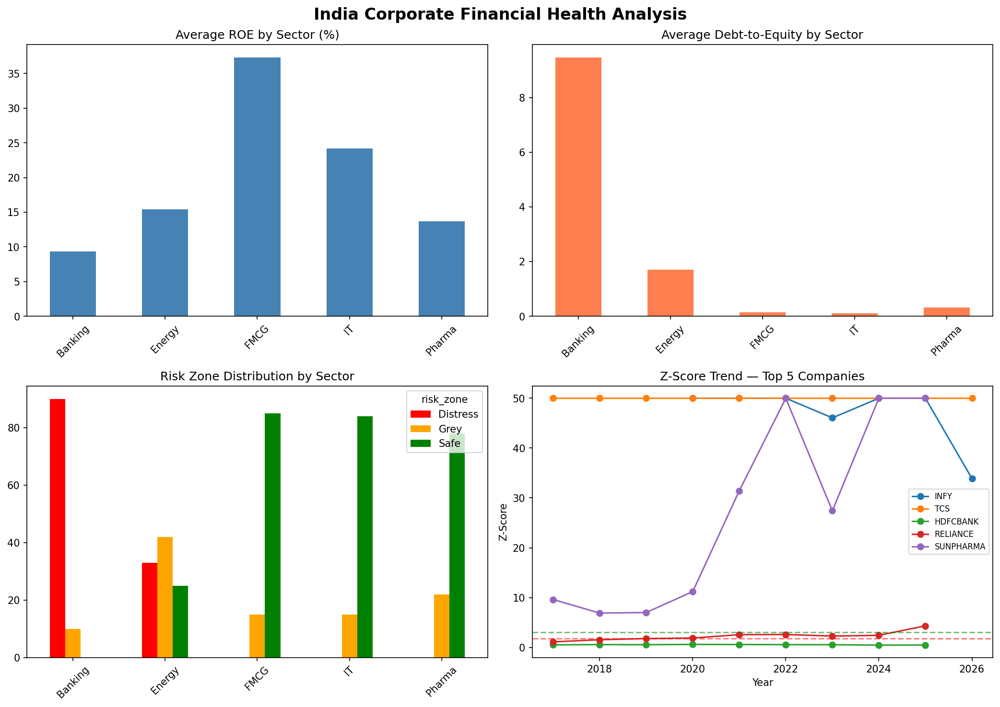

# India Corporate Financial Stress Early Warning System

## Project Overview
An end-to-end financial analytics and machine learning system that analyzes 
50 NSE-listed Indian companies across 5 sectors to predict financial distress 
Before it becomes public knowledge.

## Live Dashboard
🔗 [View Tableau Dashboard](https://public.tableau.com/views/IndiaCorporateFinancialStressEarlyWarningSystem/IndiaCorporateFinancialStressDashboard)

## Tools & Technologies
| Tool | Purpose |
|------|---------|
| MySQL | 6-table relational database — 135K+ records |
| Python / Jupyter | ETL pipeline, EDA, ML modeling |
| XGBoost | Financial distress classification — 91% accuracy |
| Tableau | Interactive dashboard — 6 chart components |
| Excel | Z-Score calculator and ratio scorecard |

## Data Sources
| Source | Data | Method |
|--------|------|--------|
| Screener.in | Financial statements — 50 companies × 10 years | Manual download |
| NSE India | Company list and sector mapping | CSV download |
| RBI / data.gov.in | Repo rate, CPI inflation, GDP growth | CSV download |
| yfinance (Python) | 134,639 daily stock prices | Automated API |

## Database Schema
companies        →     50 rows
macro_indicators →    129 rows
financial_data   →    499 rows
stock_prices     → 134,639 rows
zscore_results   →    499 rows
ml_predictions   →    499 rows

## Key Findings
- **Banking sector** — 90% distress signals due to high leverage model
- **FMCG and IT** — 85%+ safe companies, strongest sectors
- **Energy sector** — most volatile, commodity price sensitive
- **RBI Repo Rate** — ranked 4th in ML feature importance
- **Total Borrowings** — #1 driver of financial distress (24% importance)

## ML Model Performance
| Model | Accuracy |
|-------|---------|
| Logistic Regression | 77% |
| Random Forest | 84% |
| XGBoost | **91%** ✅ |

## Altman Z-Score Classification
Safe Zone     → Z > 2.99   → 272 signals (54%)
Grey Zone     → Z 1.81-2.99 → 104 signals (21%)
Distress Zone → Z < 1.81   → 123 signals (25%)

## Project Structure
india-financial-stress-early-warning/
├── clean_schema.sql          ← MySQL database schema
├── sql2.sql                  ← Analysis queries
├── 01_data_loading.ipynb     ← Data pipeline
├── 02_eda_zscore.ipynb       ← EDA + Altman Z-Score
├── 03_ml_model.ipynb         ← XGBoost classifier
├── Master_file.ipynb         ← Combined CSV export
├── master_tableau.csv        ← Tableau data source
├── zscore_calculator.xlsx    ← Excel Z-Score model
├── eda_charts.png            ← EDA visualizations
└── feature_importance.png    ← ML feature importance

## Interview Highlights
- Real Indian market data — not Kaggle
- Macro + company data combined (unique approach)
- Data leakage caught and fixed
- 3 ML models evaluated and compared
- End-to-end pipeline from raw data to dashboard

## Author
**Navaneeth M**  
Aspiring Data Analyst | Bengaluru, India  
📊 [Tableau Public Profile](https://public.tableau.com/app/profile/navaneeth1707)
